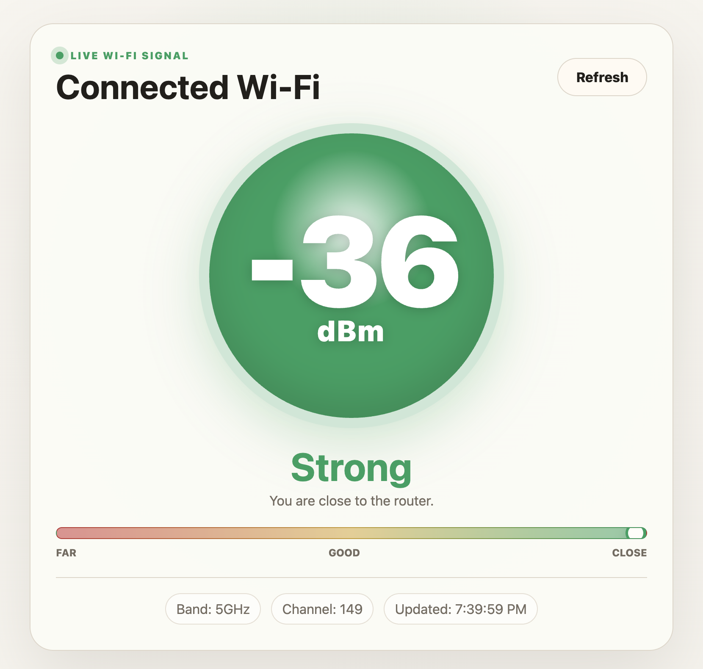

<div align="center">

# Wi-Fi Signal Live

**A focused desktop app for watching live Wi-Fi signal strength while you walk around.**

No setup. No network picker. No dashboards. Just the Wi-Fi your computer is already connected to, shown as a large live dBm reading.



[](https://github.com/marcusperdue/wifi-signal-app/actions/workflows/ci.yml)


</div>

## What It Does

Wi-Fi Signal Live turns your laptop into a simple signal meter.

- Shows a large live RSSI reading in `dBm`
- Updates automatically every 3 seconds
- Turns green when close to the router and red when signal gets weak
- Shows band, channel, and last updated time
- Reads the Wi-Fi network your computer is already connected to

## Why This Exists

Most Wi-Fi tools are overbuilt when all you need is a quick answer:

> Is the signal strong here, or am I too far away?

Open the app, walk around, and watch the number and color change.

## Signal Guide

| Signal | Label | Meaning |
| --- | --- | --- |
| `-55 dBm` or better | Strong | Close to the router or access point |
| `-56` to `-67 dBm` | Good | Reliable area |
| `-68` to `-75 dBm` | Fair | Usable, but getting weaker |
| `-76` to `-85 dBm` | Weak | Move closer if possible |
| Worse than `-85 dBm` | Very weak | Dropouts likely |

## Platform Support

| Platform | Status | Reader |
| --- | --- | --- |
| macOS | Supported | CoreWLAN first, `system_profiler` fallback |
| Windows | Basic support | `netsh wlan show interfaces` |
| Linux | Planned | `nmcli` or `iw` reader needed |

On macOS, the SSID may be hidden by privacy controls. When that happens, the app shows `Connected Wi-Fi`, but the signal reading still works.

## Quick Start

```bash
git clone https://github.com/marcusperdue/wifi-signal-app.git
cd wifi-signal-app
npm install
npm run dev
```

## Scripts

| Command | Description |
| --- | --- |
| `npm run dev` | Start Vite and Electron together |
| `npm run build` | Type-check and build the renderer and Electron main process |
| `npm run check` | CI-style local build check |
| `npm run preview` | Preview the built Vite renderer |

## Project Structure

```txt
electron/
  main.ts        Native Wi-Fi signal readers and Electron window
  preload.cts    Secure bridge exposed to the renderer

src/
  main.ts        Renderer state and UI updates
  styles.css     App styling

docs/assets/
  wifi-signal-live.png
```

## Notes

- The app does not connect to Wi-Fi for you.
- To test another network, connect your computer to that network first, then refresh the app.
- Windows dBm is estimated from the signal percent reported by `netsh`.

## License

MIT
